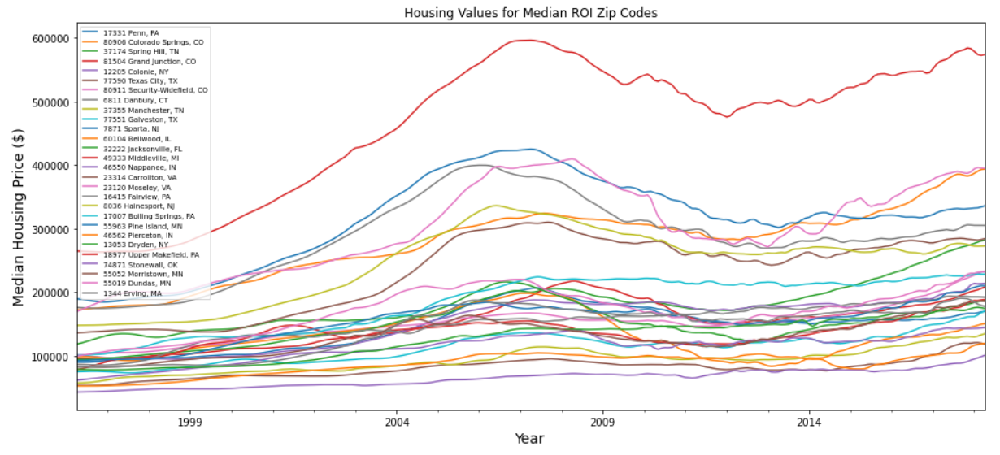
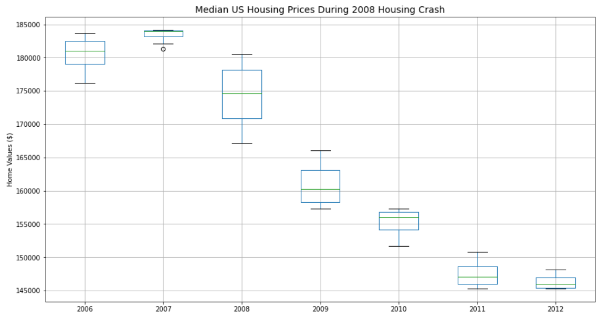
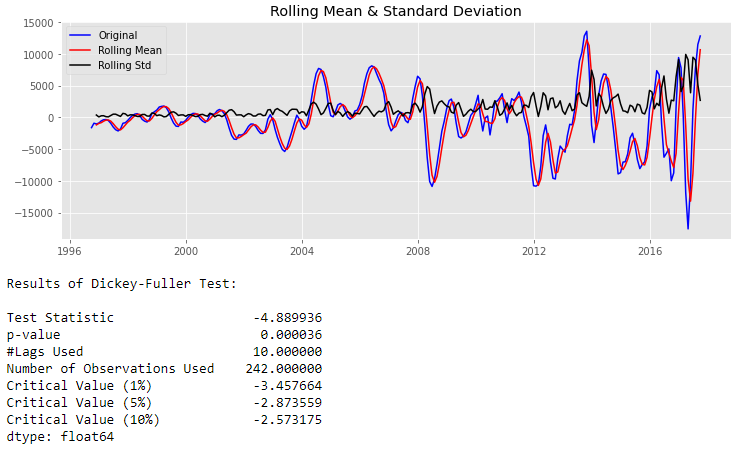

# Mod 4 Project - Time Series Modeling - Zillow US Housing Dataset
* Student name: John Cho
* Student pace: full time online
* Scheduled project review date/time: 
* Instructor name: Rafael Carrasco
* Blog post URL: https://medium.com/@johnnyboyee/the-new-generation-c-71035d37f67c

## Summary
All of the Python code was performed in the following Jupyter notebooks:
* [Cleaning.ipynb](https://github.com/johnnyboi1016/dsc-mod-4-project-v2-1-online-ds-ft-120919/blob/master/Cleaning.ipynb)
* [EDA.ipynb](https://github.com/johnnyboi1016/dsc-mod-4-project-v2-1-online-ds-ft-120919/blob/master/EDA.ipynb)
* [Models.ipynb](https://github.com/johnnyboi1016/dsc-mod-4-project-v2-1-online-ds-ft-120919/blob/master/Models.ipynb)

### Presentation Files:
* [Mod 4 - Presentation.pdf](https://github.com/johnnyboi1016/dsc-mod-4-project-v2-1-online-ds-ft-120919/blob/master/Mod 4 - Presentation.pdf)
* [Mod4 Project Video.mp4](https://github.com/johnnyboi1016/dsc-mod-4-project-v2-1-online-ds-ft-120919/blob/master/Mod4 Project Video.mp4)

This project involved the exploration and modeling of time series for US housing prices from 1996 to 2018, averaged by zip code and provided by Zillow.com. The fundamental question posed was:

#### What are the top 5 best zip codes for us to invest in?

To accomplish this, we chose to implement the following strategy:

1. **Initially combine the top 0.5% (~750) of various ROI measures and filter out for the zip codes that only appear in every group.**
2. **Create additional filters for risk and resilience to keep narrowing down the list.**
3. **Finalize selection of the top 5 zip codes for different investing risk profiles.**

Here are the metrics we have created:  

`Min_Max`(ROI) - cost basis will be the lowest value in the 12 year period, final value will be the highest.  
`1996_to_2018`(ROI) - cost basis = average price in 1996, final value = avg price in 2018.  
`Drop` - % lost or negative ROI of the drop in value from peak to valley during the 2008 crash. We'll use a slightly wider year range from 2005 to 2013 to find the min/max.  
`Recovery` - ROI from crash valley to the end of our 2018 timeframe.  
`Months` - Number of months it takes to retrace back to 'break even' from the crash valley to peak again.

Using these metrics, we were able to quickly narrow down to the top 10 zip codes.

## Notable items during EDA:

* Average home prices across the US all experienced good returns, despite the housing crash. 25/50/75 percentile values all almost or more than doubled during this 12 year period.
* Our initial top 10 zip codes more than quintupled in value on average.
* Standard deviation also more than doubled, indicative of a widening gap between the middle and upper class.
* Average drop during crash was 25% and recovery from bottom to 2018 was 33% (almost exactly break even).
* Average number of months it took to retrace from bottom of crash to bubble peak was 64 months (a little over 5 years).

## Modeling

Performed transformations to achieve stationarity: square root, exponentially weighted rolling mean, differencing scored a p-value under 0.04 for the Dickey-Fuller test. However, the seasonal_decompose function from statsmodels came in even lower so we used the residuals to fit our SARIMAX prediction model.

## Recommendations
Based on our final selection criteria and additional research, we have selected the following as our top five zip codes to invest in the United States:

**94402 San Mateo, CA (low tax rate)**  
**94061 Redwood City, CA (low tax rate, highest recovery ROI)**  
**19125 Philadelphia, PA (very good price to rent ratio, highest overall ROI)**  
**90404 Santa Monica, CA (significantly lowest number of recovery months)**  
**90232 Culver City, CA (low entry point)**

## Future Work
See if our predictions ring true by getting updated housing data from Zillow!